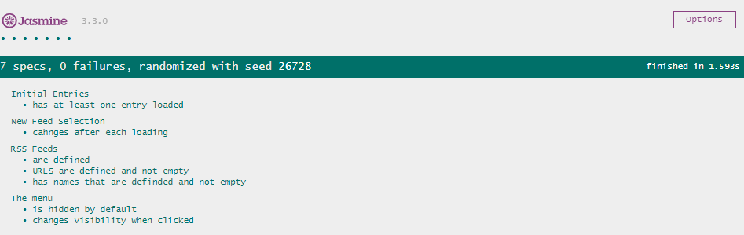

# Jasmine -Test-FeedReader

In this project I was given a web-based application that reads RSS feeds. The original developer of this application clearly saw the value in testing, they've already included [Jasmine](http://jasmine.github.io/) and even started writing their first test suite! Unfortunately, they did not complete their testing and I was tasked as part of my Frontend Web Developer Nanodegree to complete the tests. The features for the `RSS feedreader` are as follows:
1. The user can select 4 different feed sources in a menu.
2. Each new source that is selected while load a new news feed.
3. The menu is hidden on loading of the page.
4. The menu appears when clicked on.

[//]: # (Live demo of the project)
## Instructions for the Project
- Udacity provided  `The RSS feedreader` as starter code with features included
- The purpose was to complete the test for the `RSS feedreader`

## Installation
- Clone this repository using `$git clone ` or download this file a .zip failed
- Open `index.html` file a browser of choice
- Test results are at the bottom of the page

## Test Results

## Test Suites and test for FeedReader
There are over four separate test suites, a total of seven jasmine tests.

The test suites are as follows:

1. Testsuite 1: `RSS Feeds` checks if:
   - RSS source `are defined`
   - RSS source `URLs are defined and not empty`
   - RSS source `has names that are defined and not empty`
2. Testsuite 2: `The menu` checks if:
   - The menu is `hidden by default`
   - The menu  `changes visibility when clicked`
3. Testsuite 3: `Initial Entries` checks if:
   - Initial Entries has `at least one entry loaded`
4. Testsuite 4: `New Feed Selection` checks if:
   - News Feed Selection `changes after each loading`

## Requirements
The project fulfills the project requirement set-up by the [Udacity Rubric](https://review.udacity.com/#!/rubrics/18/view)

## Skills and Technologies used
- Jasmine
- JavaScript (ES5 & ES6)

## Acknowledgements
Thanks to Udacity for procing the starter code and instruction for this project
